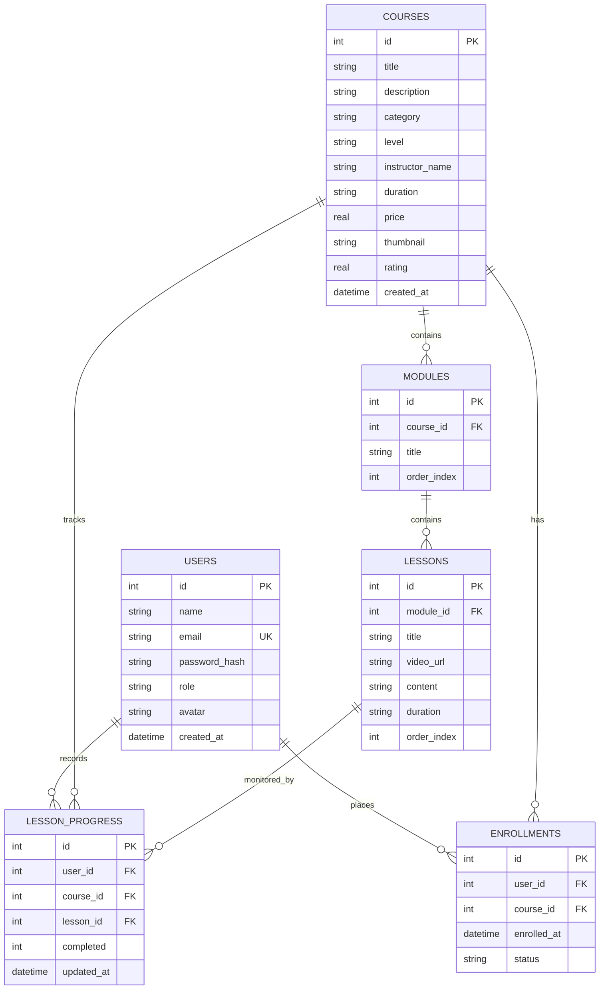

# Database Schema Documentation - Online Course Management System

## Overview
The **AcademiaPulse LMS** uses an embedded **SQLite Database Engine** with relational integrity, foreign key constraints, index optimization, and persistent table storage (`backend/database.sqlite`).

---

## Entity Relationship (ER) Diagram

---

## Detailed Table Specifications

### 1. `users` Table
Stores user accounts for Students, Admins, and Instructors with encrypted password hashes.

| Column | Type | Constraints | Description |
| :--- | :--- | :--- | :--- |
| `id` | `INTEGER` | `PRIMARY KEY AUTOINCREMENT` | Unique User ID |
| `name` | `TEXT` | `NOT NULL` | Full Name |
| `email` | `TEXT` | `UNIQUE NOT NULL` | Email Address (lowercase) |
| `password_hash` | `TEXT` | `NOT NULL` | Bcrypt hashed password |
| `role` | `TEXT` | `NOT NULL DEFAULT 'student'` | Role: `'student'`, `'admin'`, or `'instructor'` |
| `avatar` | `TEXT` | | User profile avatar image URL |
| `created_at` | `DATETIME` | `DEFAULT CURRENT_TIMESTAMP` | Account creation timestamp |

---

### 2. `courses` Table
Contains course metadata, pricing, categorization, and rating details.

| Column | Type | Constraints | Description |
| :--- | :--- | :--- | :--- |
| `id` | `INTEGER` | `PRIMARY KEY AUTOINCREMENT` | Unique Course ID |
| `title` | `TEXT` | `NOT NULL` | Course Title |
| `description` | `TEXT` | `NOT NULL` | Detailed course overview |
| `category` | `TEXT` | `NOT NULL` | Category (Web Development, Data Science, etc.) |
| `level` | `TEXT` | `NOT NULL DEFAULT 'Beginner'` | Difficulty level (Beginner, Intermediate, Advanced) |
| `instructor_name` | `TEXT` | `NOT NULL` | Assigned Instructor Name |
| `duration` | `TEXT` | `NOT NULL` | Estimated duration (e.g. `'24 Hours'`) |
| `price` | `REAL` | `NOT NULL DEFAULT 0.0` | Course price in USD |
| `thumbnail` | `TEXT` | `NOT NULL` | Cover thumbnail image URL |
| `rating` | `REAL` | `DEFAULT 4.8` | Average rating (1.0 - 5.0) |
| `created_at` | `DATETIME` | `DEFAULT CURRENT_TIMESTAMP` | Creation timestamp |

---

### 3. `modules` Table
Organizes course lessons into structured sections.

| Column | Type | Constraints | Description |
| :--- | :--- | :--- | :--- |
| `id` | `INTEGER` | `PRIMARY KEY AUTOINCREMENT` | Unique Module ID |
| `course_id` | `INTEGER` | `FOREIGN KEY (courses.id) ON DELETE CASCADE` | Parent Course ID |
| `title` | `TEXT` | `NOT NULL` | Module Title |
| `order_index` | `INTEGER` | `NOT NULL` | Module display order |

---

### 4. `lessons` Table
Individual lessons containing video URLs and reading content.

| Column | Type | Constraints | Description |
| :--- | :--- | :--- | :--- |
| `id` | `INTEGER` | `PRIMARY KEY AUTOINCREMENT` | Unique Lesson ID |
| `module_id` | `INTEGER` | `FOREIGN KEY (modules.id) ON DELETE CASCADE` | Parent Module ID |
| `title` | `TEXT` | `NOT NULL` | Lesson Title |
| `video_url` | `TEXT` | | Embedded video URL |
| `content` | `TEXT` | | Reading material / markdown notes |
| `duration` | `TEXT` | `NOT NULL` | Lesson duration (e.g. `'25 min'`) |
| `order_index` | `INTEGER` | `NOT NULL` | Lesson display order |

---

### 5. `enrollments` Table
Tracks student course enrollments.

| Column | Type | Constraints | Description |
| :--- | :--- | :--- | :--- |
| `id` | `INTEGER` | `PRIMARY KEY AUTOINCREMENT` | Unique Enrollment ID |
| `user_id` | `INTEGER` | `FOREIGN KEY (users.id) ON DELETE CASCADE` | Enrolled Student ID |
| `course_id` | `INTEGER` | `FOREIGN KEY (courses.id) ON DELETE CASCADE` | Course ID |
| `enrolled_at` | `DATETIME` | `DEFAULT CURRENT_TIMESTAMP` | Enrollment timestamp |
| `status` | `TEXT` | `DEFAULT 'active'` | Status (`'active'`, `'completed'`) |

*Unique Index Constraint: `(user_id, course_id)` prevents duplicate enrollments.*

---

### 6. `lesson_progress` Table
Stores granular student completion status per lesson.

| Column | Type | Constraints | Description |
| :--- | :--- | :--- | :--- |
| `id` | `INTEGER` | `PRIMARY KEY AUTOINCREMENT` | Unique Progress ID |
| `user_id` | `INTEGER` | `FOREIGN KEY (users.id) ON DELETE CASCADE` | Student ID |
| `course_id` | `INTEGER` | `FOREIGN KEY (courses.id) ON DELETE CASCADE` | Course ID |
| `lesson_id` | `INTEGER` | `FOREIGN KEY (lessons.id) ON DELETE CASCADE` | Lesson ID |
| `completed` | `INTEGER` | `DEFAULT 0` | Completion flag (`0` = Incomplete, `1` = Completed) |
| `updated_at` | `DATETIME` | `DEFAULT CURRENT_TIMESTAMP` | Last updated timestamp |

*Unique Index Constraint: `(user_id, lesson_id)`.*
